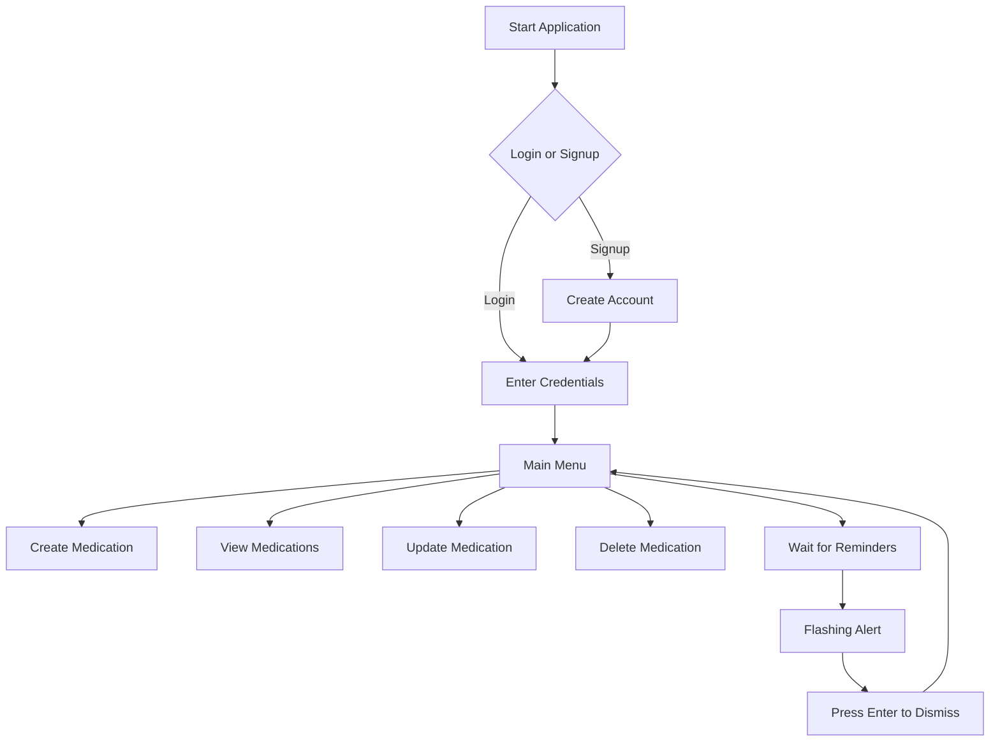

# Medication Tracker Application Documentation

## Overview
This Python application helps users manage their medication schedules by providing:
- User authentication (signup/login)
- Medication reminder creation
- Reminder management (create, read, update, delete)
- Visual flashing notifications for medication times
- Flexible scheduling (daily, weekly, monthly)

## Features

### User Authentication
- **Sign Up**: Create new account with:
  - Username (must be unique)
  - Age (0-200)
  - Gender (Male/Female/Trans)
  - Password (min 8 chars with uppercase, lowercase, digit, and special character)
- **Login**: Securely access existing account

### Medication Management
- **Create Reminders**: 
  - Medication name and dosage
  - Flexible scheduling (daily, weekly, monthly)
  - Multiple time entries per schedule
- **View Reminders**: See all scheduled medications
- **Update Reminders**: Modify medication details or schedule
- **Delete Reminders**: Remove outdated medications

### Reminder System
- **Visual Alerts**: Flashing console notifications
- **Flexible Scheduling**:
  - Daily: Set specific times (e.g., 0900, 1500)
  - Weekly: Choose days and times (e.g., Monday 0900, Friday 1500)
  - Monthly: Specific dates and times (e.g., 15th of month at 1000)
- **Countdown Display**: Shows time remaining until next dose
- **Dismissal**: Press Enter to acknowledge reminder

## Code Structure

### Core Functions
| Function | Description |
|----------|-------------|
| `calculate_next_reminder()` | Determines next scheduled medication time |
| `show_flashing_reminder()` | Displays flashing medication alert |
| `add_medication()` | Handles scheduling logic |
| `create_reminder()` | Creates new medication entry |
| `read_reminders()` | Shows all scheduled medications |
| `update_reminder()` | Modifies existing medication |
| `delete_reminder()` | Removes medication schedule |
| `wait_for_reminder()` | Monitors and triggers upcoming reminders |

### User Management
| Function | Description |
|----------|-------------|
| `sign_up()` | Registers new users |
| `login()` | Authenticates existing users |
| `ask_user()` | Main menu after login |
| `choose_action_func()` | Handles initial login/signup choice |

## How to Use

1. **Start the application**:
   ```bash
   python app.py
   ```

2. **Authentication**:
   - Choose login or signup
   - Complete required fields

3. **Manage Medications**:
   ```
   1. Create Reminders
   2. Show Reminders
   3. Update Reminders
   4. Delete Reminders
   5. Check for next reminder and wait
   6. Exit
   ```

4. **Scheduling Options**:
   - Daily: Enter times in military format (e.g., 0900 for 9 AM)
   - Weekly: Select days (Monday-Sunday) and times
   - Monthly: Enter dates (ddmmyyyy) and times

## Example Workflow



## Dependencies

| Package | Description |
|---------|-------------|
| `datetime` | Date/time operations |
| `getpass` | Secure password input |
| `json` | Data storage/retrieval |
| `os` | Operating system interactions |
| `time` | Time-related functions |
| `select` | Input monitoring |

## Security Features
- Password complexity requirements
- Secure password input (hidden typing)
- Unique username enforcement
- Data encryption in storage (JSON)

## Future Enhancements
- Email/SMS notifications
- Mobile app integration
- Refill reminders
- Medication history tracking
- Doctor sharing functionality

> **Note**: The application stores all data in `users.json` in the same directory. Always backup this file before updating the application.